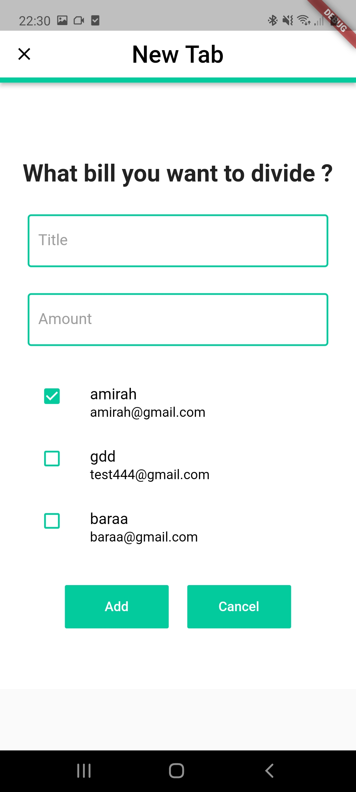

# Expense Sharing Flutter App with Firebase

A mobile application to help people calculate and manage their shared expenses.

### General

- Sign up and log in for authentication.
- Viewing all the expenses currently shared with friends.
- Viewing the details of the expenses.
- Deleting the expenses.
- Adding a new expense and inputting the users that are own.
- Adding new friends to share an expense with.

## Objective

- Help users calculate their shared expenses. 
- Allow users to add friends to the app to share expenses with them.
- Give the creator of the expense the ability to remove an expense for all the users.
- Store all the data on a firestore database to manage and manipulate.
### The use of HTTP calls in
- Login page to show the relevant greeting in Kuala Lumpur time.
- Home page to show a user money management advice every time they log in.

### APIs use: 
- http://worldtimeapi.org Used for fetching the current KL time 
- We also made our own API with node js: https://ancient-bastion-99124.herokuapp.com Used for fetching random money management advice.

## Firestore structure 

- User collection that contains the the user data
- Friends collection that contains the details on the user’s friends
- expenses collection that contains the list of expenses of the users

## How to run the code 
- To run the application you need to create a flutter app `flutter create {application name}` 
- Then run `flutter run` after connecting to an emulator 
- check the connection with firebase through the google-services.json 

### Notes 
- The project is made for android. 

### Screenshots

  |   |   
  |   |   
  
